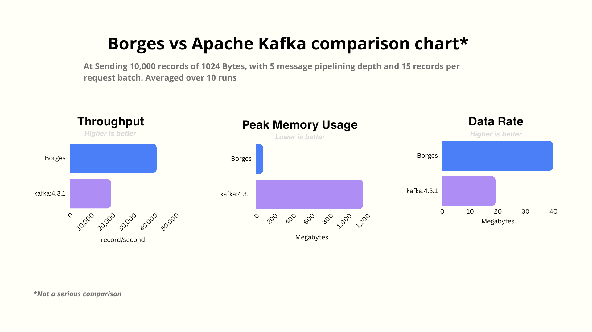
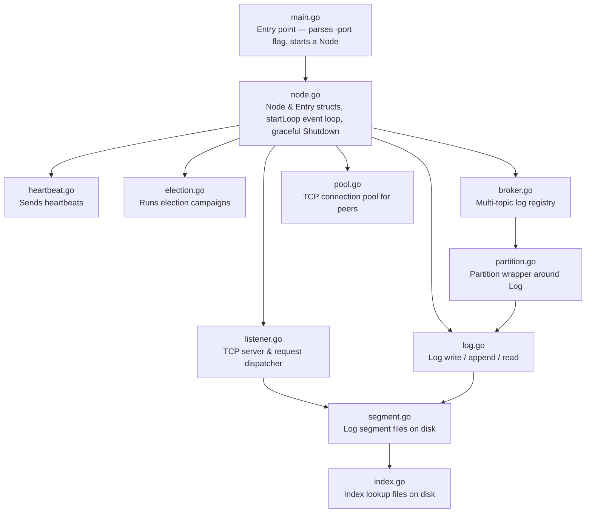
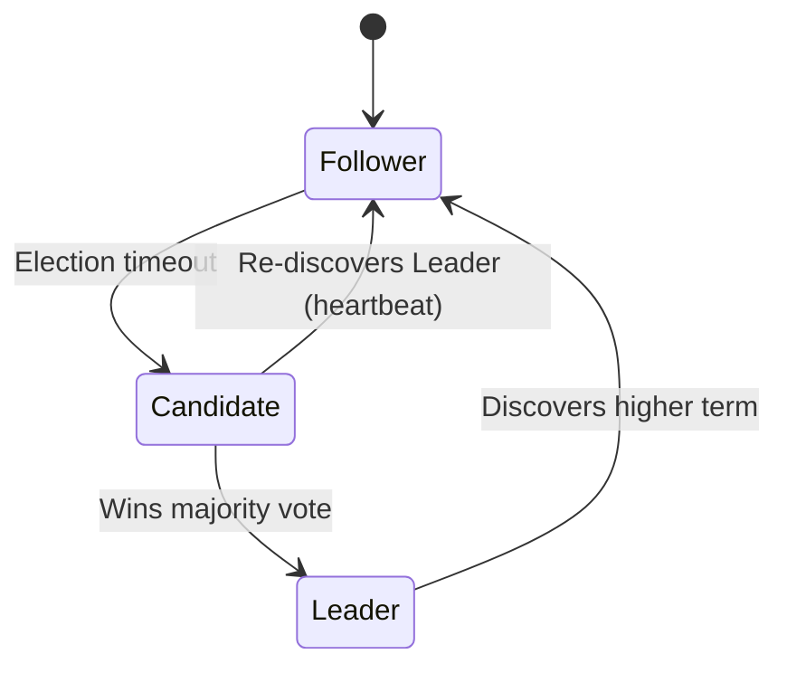

# Borges

Borges is a minimal, low-level message broker inspired by Apache Kafka, implemented entirely from scratch in Go, with a working Raft consensus layer for leader election and log replication across a cluster. Named after the writer Jorge Luis Borges, a huge fan of Franz Kafka

Instead of relying on high-level database or clustering abstractions, this project focuses on the core primitives of distributed event streaming: building an append-only log, managing segment rotation, implementing custom binary wire protocols, structuring efficient index files, and replicating that log consistently across nodes using Raft.

Nodes start as Followers, hold Elections when a leader goes quiet, and once a Leader emerges, it replicates every produced entry to its peers via AppendEntries. Clients produce, consume, and commit offsets through a custom binary protocol, with per-topic segmented logs and index files handling on-disk persistence underneath it all.

## Contents

- [Getting Started](#getting-started)
- [Client SDK](#client-sdk)
- [Benchmarking](#benchmarking)
- [Architecture](#architecture)
- [Node State](#node-state)
- [Event Loop](#event-loop-startloop)
- [Peer Connection Pool](#peer-connection-pool-peerpool)
- [Wire Protocol](#wire-protocol)
- [State Persistence](#state-persistence)
- [Log Persistence (WAL & Indexing)](#log-persistence-wal--indexing)
- [Graceful Shutdown](#graceful-shutdown)
- [Current Limitations & Future Improvements](#current-limitations--future-improvements)

## Getting Started

### Running the nodes

Open three terminals and run one instance on each port:

```bash
go run . -port 8080 -peers 8081,8082
go run . -port 8081 -peers 8080,8082
go run . -port 8082 -peers 8080,8081
```

All nodes start as **Follower**. The first node to time out and gather a majority of votes becomes the **Leader** and begins sending periodic heartbeats to the others.

## Client SDK

Borges ships with a Go client SDK at [`sdk/`](sdk/SDK.md).

```go
import "github.com/adnanmaja/borges/sdk"
```

The SDK auto-discovers the cluster leader and provides `Producer` and `Consumer` types for reading and writing messages. See [`sdk/SDK.md`](sdk/SDK.md) for full docs and API reference.

A smoke test is available at `tools/smoke-test/` and a benchmarking tool at `tools/bench/` (both gitignored).

## Benchmarking
*Sending 10,000 records of 1024 Bytes, with 5 message pipelining depth and 15 records per request batch. Averaged over 10 runs*

| Metric | Apache Kafka v4.3.1 | Borges (3 nodes, localhost)|
| --- | --- | --- |
| **Throughput** | 19,431.42 records/sec | **40,909.02 records/sec** |
| **Data Rate** | 19.28 MB/sec | **39.95 MB/sec** |
| **Peak Memory Usage** | 1,155.90 MB | **77.64 MB** |
| **Latency** | 1,209.33 ms | **0.84 ms** |



> **Disclaimer:** Not a serious comparison ofc, but a fun one regardless

## Architecture



### File responsibilities

| File | Role |
|---|---|
| `main.go` | CLI flag parsing, node instantiation |
| `internal/raft/node.go` | `Node` & `Entry` structs, `NewNode()` constructor, `startLoop()` event loop, `Shutdown()` graceful teardown, `saveStates()`/`loadStates()` binary persistence, `compactMemory()` entry cap at 1000, `snapshotEntries()`/`loadEntrySnapshot()` JSON entry persistence |
| `internal/raft/heartbeat.go` | Leader sends heartbeats to peers over TCP (with 1 retry on failure) |
| `internal/raft/election.go` | Election campaign (`StartElection`), vote request/response (`Vote`), victory announcement (`CountVote`), vote request retry |
| `internal/raft/listener.go` | TCP listener, opcode parsing, and dispatching client produce/consume and Raft requests |
| `internal/raft/broker.go` | Multi-topic log registry (`Broker`), maps topic names to `Log` instances, tracks consumer-group offsets (`SaveOffset`/`FetchOffset`), periodic offset snapshot persistence with atomic tmp+rename |
| `internal/raft/log.go` | Per-topic log manager (`Log` struct), batch write/append/read functions, wire-level log transmission, CRC32-checksummed disk format, buffered batched I/O with `sync.Pool` |
| `internal/raft/partition.go` | Thin wrapper around a `*Log` with a partition ID |
| `internal/raft/segment.go` | Representation of individual `.log` data files (max 1MB) |
| `internal/raft/index.go` | Representation of individual `.index` files with binary search offsets for fast log lookups |
| `internal/raft/pool.go` | `ConnPool` struct — cached TCP connections to peers with lazy creation and eviction |

## Node State

```go
type Entry struct {
    timestamp int64
    payload   []byte
    term      int32
}

type Node struct {
    port        int16
    peers       []int16
    role        string          // "Follower", "Candidate", or "Leader"
    currentTerm int32
    votedFor    int16
    voteCount   int32

    heartbeat     <-chan time.Time // fires every 5s — Leader sends heartbeats
    electionTimer *time.Timer      // fires on timeout — triggers election
    lastHeartbeat time.Time

    entries     []Entry         // replicated log entries (1-based index)
    commitIndex int32           // index of highest log entry known to be committed
    nextIndex   map[int16]int32 // for each server, index of the next log entry to send
    matchIndex  map[int16]int32 // for each server, index of highest log entry known to be replicated

    broker          *Broker     // multi-topic log registry
    listener        net.Listener
    heartbeatTicker *time.Ticker
    stopCh          chan struct{}
    connPool        *ConnPool    // cached TCP connections to peers

    mu sync.Mutex // protects node state access
}
```

### Role transitions



## Event Loop (`startLoop`)

The main loop runs in `node.go` and multiplexes on three channels:

| Channel | When it fires | Action |
|---|---|---|
| `heartbeat` | Every 5 seconds | If **Leader**, broadcast `Heartbeat()` to all peers |
| `electionTimer.C` | After random timeout (8–18s) | If not Leader, call `StartElection()` |
| `stopCh` | On `Shutdown()` | Exit the loop and clean up |

## Peer Connection Pool (`ConnPool`)

`pool.go` provides a `ConnPool` that lazily creates and caches TCP connections to peer nodes, avoiding the cost of a fresh `net.Dial` on every heartbeat or replication round.

| Method | Behaviour |
|---|---|
| `GetOrCreateConnection(port)` | Returns a cached connection for the given peer port, or dials one and caches it |
| `Evict(port)` | Closes and removes a stale connection on I/O errors |

The pool is used by `Heartbeat()` and by `Log.Write()` during leader replication. On dial or read/write failures the caller evicts the connection so the next attempt re-dials.

## Wire Protocol

All messages are TCP frames with a binary layout.

### Common header

| Field | Size | Description |
|---|---|---|
| opcode | 2B | Request type |
| from | 2B | Sender identifier |
| payload | variable | Opcode-specific body |

Response frames consist of a single 2-byte status/response code.

### Opcode types

| Opcode | Command | Direction | Description |
|---|---|---|---|
| `0x0004` | Heartbeat | Leader → Follower | Periodic keep-alive |
| `0x0005` | Vote Request | Candidate → Peers | Candidate requests votes |
| `0x0006` | Client Produce | Client → Node | Client sends a batch of log entries to a topic |
| `0x0007` | Append Entries | Leader → Follower | Leader replicates log entries to followers |
| `0x0008` | Client Consume | Client → Node | Client requests log entries by topic, offset, and count |
| `0x0009` | Commit Offset | Client → Node | Client commits a consumer offset for a group/topic |
| `0x0010` | Fetch Offset | Client → Node | Client retrieves a previously committed offset for a group/topic |
| `0x0012` | Create Topic | Client → Node | Client creates a topic with a given number of partitions |
| `0x0013` | Partitions Count | Client → Node | Client queries the number of partitions for a topic |

#### Client Produce (`0x0006`)

Supports batching — up to 100 entries per request. All entries in a batch are written to disk in a single I/O call.

| Field | Size | Description |
|---|---|---|
| opcode | 2B | `0x0006` |
| from | 2B | Sender identifier |
| topicLen | 4B | Length of the topic name |
| topic | `topicLen` bytes | Topic to write to |
| partitionId | 4B | Which partition to produce to |
| entriesCount | 4B | Number of entries in this batch (max 100) |
| payloadLen | 4B | Length of an entry's payload *(repeated per entry)* |
| payload | `payloadLen` bytes | Entry value *(repeated per entry)* |

#### Append Entries (`0x0007`)

| Field | Size | Description |
|---|---|---|
| leadTerm | 4B | Leader's current term |
| prevIdx | 4B | Index of the log entry preceding the new ones |
| prevTerm | 4B | Term of the `prevIdx` entry |
| commitIdx | 4B | Leader's commit index |
| topicLen | 4B | Length of the topic name |
| topic | `topicLen` bytes | Topic these entries belong to |
| partitionId | 4B | Which partition these entries belong to |
| entryNum | 2B | Number of entries being sent |

Each of the `entryNum` entry structs is laid out as:

| Field | Size | Description |
|---|---|---|
| timestamp | 8B | Millisecond Unix timestamp when the entry was created |
| entryLen | 4B | Length of the log command string |
| entryPayload | `entryLen` bytes | The log command string |

#### Client Consume (`0x0008`)

Request:

| Field | Size | Description |
|---|---|---|
| topicLen | 4B | Length of the topic name |
| topic | `topicLen` bytes | Topic to consume from |
| partitionId | 4B | Which partition to read from |
| startOffset | 8B | Starting relative offset to retrieve from |
| sizeLimit | 4B | Maximum number of entries to return |

Response — success (`0x0001`):

| Field | Size | Description |
|---|---|---|
| status | 2B | `0x0001` |
| entryCount | 4B | Number of entries returned |
| timestamp | 8B | Timestamp of an entry *(repeated per entry)* |
| payloadLen | 4B | Length of the entry payload *(repeated per entry)* |
| payload | `payloadLen` bytes | Entry value *(repeated per entry)* |

Response — failure (`0x0002`): a single 2-byte status code.

#### Commit Offset (`0x0009`)

| Field | Size | Description |
|---|---|---|
| groupIdLen | 4B | Length of the consumer group id |
| groupId | `groupIdLen` bytes | Consumer group identifier |
| topicLen | 4B | Length of the topic name |
| topic | `topicLen` bytes | Topic name |
| partition id | 4B | in which partition this offset should be stored at |
| offsetCommit | 8B | Offset value to commit for this group/topic |

Response: a single 2-byte status code.

#### Fetch Offset (`0x0010`)

Request:

| Field | Size | Description |
|---|---|---|
| groupIdLen | 4B | Length of the consumer group id |
| groupId | `groupIdLen` bytes | Consumer group identifier |
| topicLen | 4B | Length of the topic name |
| topic | `topicLen` bytes | Topic name |
| partition id | 4B | from which partition |

Response:

| Field | Size | Description |
|---|---|---|
| status | 2B | `0x0001` on success |
| offset | 8B | The committed offset |

#### Create Topic (`0x0012`)

Used by clients to programmatically create a topic. If the receiving node is the leader, it creates the partitions locally and propagates the creation to all followers. Followers apply the creation locally on receipt.

Request:

| Field | Size | Description |
|---|---|---|
| opcode | 2B | `0x0012` |
| from | 2B | Sender identifier |
| topicLen | 4B | Length of the topic name |
| topic | `topicLen` bytes | Topic to create |
| numPartitions | 4B | Number of partitions for this topic |

Response: a single 2-byte status code.

Propagation frame (leader → follower):

| Field | Size | Description |
|---|---|---|
| opcode | 2B | `0x0012` |
| from | 2B | Sender identifier |
| topicLen | 4B | Length of the topic name |
| topic | `topicLen` bytes | Topic to create |
| numPartitions | 4B | Number of partitions for this topic |

#### Partitions Count (`0x0013`)

Queries the number of partitions for a given topic.

Request:

| Field | Size | Description |
|---|---|---|
| opcode | 2B | `0x0013` |
| from | 2B | Sender identifier |
| topicLen | 4B | Length of the topic name |
| topic | `topicLen` bytes | Topic to query |

Response:

| Field | Size | Description |
|---|---|---|
| status | 2B | `0x0001` on success |
| partitionCount | 4B | Number of partitions for the topic |

### Response / status codes (common)

| Code | Value | Meaning |
|---|---|---|
| Success / Granted | `0x0001` | Vote granted, log write/append succeeded, or consume succeeded |
| Failure / Denied | `0x0002` | Vote denied, log write/append failed, or consume failed |

## State Persistence

### Volatile state (`saveStates` / `loadStates`)

`currentTerm` and `votedFor` are persisted to disk as a compact 6-byte binary file (`data/<port>/states.bin`):

| Field | Size |
|---|---|
| currentTerm | 4B |
| votedFor | 2B |

`saveStates` is a synchronous, on-demand call invoked at every state-change point that matters for correctness, rather than a periodic JSON write:

| When `saveStates` is called |
|---|
| A node votes for itself at the start of an election |
| A node grants a vote to a remote candidate |
| A follower's `Append` call detects that the leader's term is newer than its own |

### Offset snapshot (`saveSnapshot` / `loadSnapshot`)

The `Broker`'s consumer-group offset map is persisted periodically (every 10s) to `data/<port>/offset_snapshot.json` by the `broker.saveSnapshot` goroutine launched from `NewNode`.

### Entry snapshot (`snapshotEntries` / `loadEntrySnapshot`)

`node.entries` (the in-memory Raft log) is persisted periodically (every 10s) to `data/<port>/entry_snapshot.json` by the `node.snapshotEntries` goroutine launched from `NewNode`. On restart, `loadEntrySnapshot` recovers these entries so the Raft log's term history is preserved for consistency checks during log replication. The snapshot is also written during `Shutdown` to minimise data loss.

## Log Persistence (WAL & Indexing)

Log persistence is segmented, with accompanying index files to optimize retrieval:

1. **Log segments** — per-topic log files are stored on disk under `data/<port>/log/<topic>/<partitionId>/` as `<offset>.log` files (e.g. `00000000000000000000.log`). Each partition has its own set of segments, index files, and offset numbering. Each segment file has a 1MB size limit.
2. **Index files** — each segment has a companion `<offset>.index` file storing 16-byte index entries:

   | Field | Size |
   |---|---|
   | relativeOffset | 8B |
   | byteOffset | 8B |

   This enables binary search from a target relative offset directly to a byte position in the segment file.
3. **Log entry format** — each entry written to a `.log` file has the layout:

   | Field | Size |
   |---|---|
   | crc32 | 4B |
   | timestamp | 8B |
   | payloadLen | 4B |
   | payload | `payloadLen` bytes |

   The 4-byte CRC32 checksum covers the entry payload and is verified on read — entries with mismatched checksums return a corruption error.
4. **Batch writes** — `writeToDisk` accepts multiple entries in a single call and encodes them into one pre-allocated buffer from a shared `sync.Pool`, reducing heap allocations. The companion index entries are also written in one batch. After each batch, the buffered writer is explicitly flushed to disk.
5. **File descriptor cache** — the `Log` maintains an `fdCache` mapping index and segment paths to open `*os.File` handles, avoiding redundant `os.Open` calls during consumer reads.
6. **Startup recovery** — on startup, a node creates per-topic, per-partition directories under `data/<port>/log/<topic>/<partitionId>/`. The in-memory Raft log (`node.entries`) is recovered from `data/<port>/entry_snapshot.json` (see [Entry snapshot](#entry-snapshot-snapshotentries--loadentrysnapshot)), preserving term history for Raft consistency checks.

## Graceful Shutdown

`node.Shutdown()` persists volatile state and exits immediately:

1. Locks the node mutex, calls `saveStates()` to persist `currentTerm` and `votedFor`, and writes the entry snapshot (`node.entries`) to `entry_snapshot.json`.
2. Writes a final offsets snapshot to `offset_snapshot.json`.
3. Calls `os.Exit(0)` — the process terminates immediately regardless of any in-flight goroutines.

## Current Limitations & Future Improvements

- **Memory cap** — `compactMemory()` keeps `node.entries` at most 1000 entries. This prevents unbounded growth but means only recent history is available in memory for replication.
- **Single-response produce** — the leader sends one success/failure response after the entire batch is processed; partial batch failures are not distinguished. A 6-second timeout goroutine fires if a majority ack is never reached.