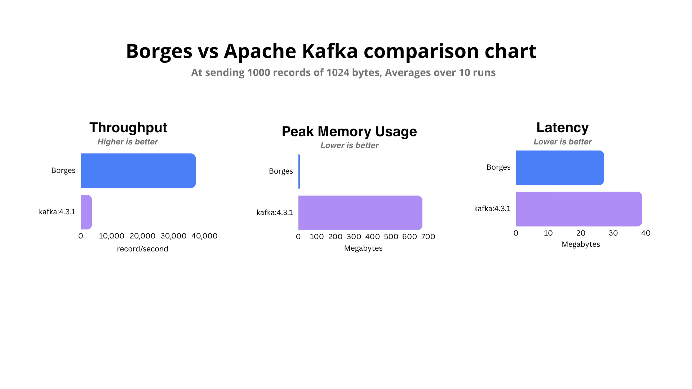

# Borges

Borges is a minimal, low-level, single-node message broker inspired by Apache Kafka, implemented entirely from scratch in Go.

Instead of relying on high-level database abstractions, this project focuses on the core storage and networking primitives of event streaming: building an append-only log, managing segment rotation, implementing custom binary wire protocols, and structuring efficient index files.


## Core Architecture

Borges is designed as a single-node broker tailored for highly concurrent TCP clients. It interacts directly with the file system to achieve low-overhead message persistence.

* **Broker (`broker.go`):** Acts as the central orchestrator mapping topics to logs and managing consumer group offsets. It handles crash recovery by loading historical snapshots on startup.
* **TCP Server (`network.go`):** A concurrent server listening on `:8080`. It handles state transitions for active connections and executes custom framing commands. Supports graceful shutdown via `SIGINT`/`SIGTERM` by draining connections, flushing buffers, and forcing an offset snapshot.
* **Log Storage (`log.go`):** Manages the lifecycle of an append-only sequence of records distributed across discrete disk segments. Runs a background janitor goroutine every 30 seconds for retention-based cleanup.
* **Segments (`segment.go`):** Fixed-size log segments (1 KB for testing, 1 MB for production). When a segment fills, it rotates seamlessly to a new file. Features fine-grained, per-segment locks to maximize write concurrency.
* **Index Engine (`index.go`):** Maps relative offsets to physical byte positions within the `.log` files. Utilizes a 16-byte fixed layout per entry (`8-byte relative offset + 8-byte absolute offset`) to perform efficient $O(\log n)$ binary search lookups.


## Custom Wire Protocol

Borges utilizes a raw, custom binary protocol over TCP to bypass the overhead of text-based serialization (like JSON or HTTP framing).

### Requests

| Command | Hex Opcode | Payload Layout |
| --- | --- | --- |
| **Produce** | `0x01` | `[2B topic len][topic][4B msg count] + loop([4B payload len][N-byte payload])` |
| **Consume** | `0x02` | `[2B topic len][topic][8B offset]` |
| **Fetch Offset** | `0x03` | `[2B group len][group id][2B topic len][topic]` |
| **Commit Offset** | `0x04` | `[2B group len][group id][2B topic len][topic][8B offset]` |

### Responses

* **Produce:** `[0x00]` (Success) or `[0x01]` (Error)
* **Consume:** `[0x00][8B Unix ms timestamp][4B payload len][N-byte payload]`
* **Fetch Offset:** `[0x00][8B offset]`
* **Commit Offset:** `[0x00]` (Success)


## Storage Format

Topics are entirely isolated into dedicated directories under the `logs/` root. Files utilize zero-padded 64-bit integer naming schemas based on the **base offset** of the segment:

```text
logs/
├── offset_snapshot.json           # Consumer group offset snapshot (JSON)
└── <topic>/
    ├── 00000000000000000000.log   # Raw record payloads
    ├── 00000000000000000000.index # Offset-to-byte positions
    ├── 00000000000000000032.log   # New log segment after rotation
    └── 00000000000000000032.index # New index segment

```

### On-Disk Binary Layouts

* **Log Record:** `[4B CRC32 Checksum][4B Payload Length][8B Unix ms Timestamp][N-byte Payload]`
* **Index Entry:** `[8B Relative Offset][8B Absolute Byte Offset]`
* **Retention Policy:** Closed segments older than 10 minutes are automatically reaped by a background cleaner running every 30 seconds to bound disk utilization.


## Performance Optimizations

To maximize throughput and minimize latency, several low-level optimizations have been implemented:

* **Index Binary Search:** Upgraded offset resolution from an $O(n)$ linear scan to an $O(\log n)$ binary search over fixed-width index files.
* **Segment-Level Locking:** Replaced a global log lock with granular, per-segment mutexes (`segment.mu`), enabling parallel writes to different segments.
* **Buffered Index I/O:** Batches index writes using a 4 KB `bufio.Writer`. The buffer is only flushed to disk during segment rotation or graceful shutdowns, saving thousands of costly system calls.
* **In-Memory Index Caching:** Hot index lookups are served entirely from an in-memory `map[int64]int64` guarded by a `sync.RWMutex`, ensuring lock-free reads alongside active writes.
* **Write Buffer Pooling:** Uses a `sync.Pool` to reuse pre-allocated byte slices on the hot `Produce` path, drastically lowering GC pressure and heap allocations.
* **Zero-State Random Access:** Leverages `os.File.ReadAt` for message consumption. This bypasses the need to maintain seek-pointer state adjustments, unlocking thread-safe concurrent reads on shared file descriptors.
* **Compile-Time Debug Gating:** Guarded intensive `[DEBUG]` logs behind a compile-time `const debug = false` toggle, completely stripping formatting overhead from the production binary.
* **Batch Message Framing:** The `Produce` wire protocol supports multi-message payloads, reducing network round-trips and transport framing overhead.


## Benchmarks

*Measured by streaming 1,000 records of 1,024 bytes each, averaged over 10 runs.*

| Metric | Apache Kafka v4.3.1 | Borges (Single Node) |
| --- | --- | --- |
| **Throughput** | 3,615.54 records/sec | **37,198.98 records/sec** |
| **Latency** | 38.90 ms | **27.15 ms** |
| **Peak Memory** | 668.70 MB | **9.42 MB** |



> **Disclaimer:** This comparison is intended for educational amusement. Apache Kafka is a highly distributed, partitioned, replicated, production-grade system running on the JVM with complex persistence and durability guarantees. Borges achieves its performance by operating entirely as a single-node broker without network replication, consumer rebalancing, or multi-partition coordination.

---

## Getting Started

### Prerequisites

* Go 1.21 or higher

### Running the Broker

Spin up the TCP streaming server:

```bash
go run main.go

```

---

## Project Structure

```text
├── main.go             # Application entrypoint & configuration
├── internal/  
│   └── engine/  
│       ├── broker.go   # Topic state and offset coordinator
│       ├── log.go      # Log manager & retention controller
│       ├── segment.go  # Isolated data segment mechanics
│       ├── index.go    # Fixed-width binary index lookups
│       ├── config.go   # Global constants
│       └── network.go  # TCP server and protocol framing parser
├── logs/               # Active runtime data directory (Git-ignored)
└── go.mod              # Go module definition

```
